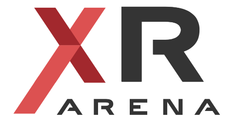

  

<h2 align="center">ARENA browser client (ARENA-core)</h2>

<b>An environment to view and interact in multiuser virtual and augmented reality</b>

| <video src="https://user-images.githubusercontent.com/3301067/179424252-ff81a626-218b-4228-859f-6e5d86f09093.mp4"/> | <video src="https://user-images.githubusercontent.com/3301067/179424259-45a212b4-dff7-4d6d-b8cd-a349ac0d808d.mp4"/> |
|---------------------------------------------------------------------------------------------------------------------|---------------------------------------------------------------------------------------------------------------------|
| <video src="https://user-images.githubusercontent.com/3301067/179424261-8d2bde4b-bcd8-4006-b873-865ea9905927.mp4"/> | <video src="https://user-images.githubusercontent.com/3301067/179424266-cdf1241d-5d1a-4f37-bcf4-f2d8baf2af2e.mp4"/> |

The [ARENA](https://docs.arenaxr.org/) is a platform for supporting real-time mixed reality (XR) interaction between multiple users and the physical world.

This repository contains the ARENA browser client code, which allows to view and interact in multiuser virtual and augmented reality. It was built using frameworks for 3D scenes and XR environments (notably, [A-Frame](https://aframe.io/) and  [three.js](https://threejs.org/)), and can be used with any platform supporting a WebXR-capable browser (e.g. most desktop/laptops, iPads, iPhones, Android ARCore-enabled devices, Oculus Quest, Vive, Microsoft Hololens and many other).

The ARENA browser client uses a [publish/subscribe system](https://mqtt.org/) to allow users and programs to colaborate and takes advantage of [Jitsi](https://jitsi.org/) to support video conferencing in a 3D environment. We also leverage WASM‘s availability in all major browsers and other platforms outside the browser to execute distributed XR applications.

## Documentation
The main ARENA documentation is here: [https://docs.arenaxr.org/](https://docs.arenaxr.org/).

- [Quick Start for users](https://docs.arenaxr.org/content/overview/user-guide.html).
- [Quick Start for developers](https://docs.arenaxr.org/content/overview/dev-guide.html).

## Installation

Most users will want to use an already deployed ARENA. If you want to setup your own ARENA stack, you can use our [docker compose setup](https://github.com/arenaxr/arena-services-docker).

## License

See the [LICENSE](LICENSE) file.
