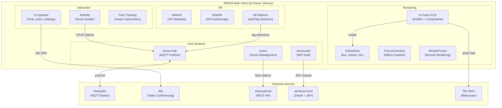
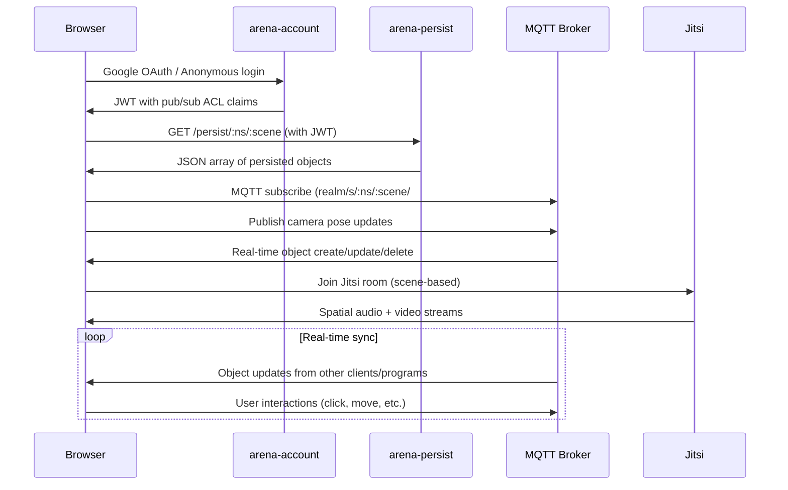

# ARENA Web Core — Requirements & Architecture

> **Purpose**: Machine- and human-readable reference for the ARENA browser client's features, architecture, and source layout.

## Architecture

## Source File Index

| File / Directory | Role | Key Symbols |
|------------------|------|-------------|
| [index.html](index.html) | Scene entry point | loads A-Frame scene, auth flow |
| [landing.html](landing.html) | Landing / scene selector page | scene list, realm selector |
| [src/index.js](src/index.js) | Module entry point | registers all systems and components |
| [src/systems/core/](src/systems/core/) | Core systems (14 files) | MQTT, auth, scene management, health, permissions |
| [src/systems/ui/](src/systems/ui/) | UI systems (9 files) | chat, user list, settings, runtime manager |
| [src/systems/scene/](src/systems/scene/) | Scene systems (5 files) | entity loading, scene options, landmarks |
| [src/systems/armarker/](src/systems/armarker/) | AR marker system (14 files) | AprilTag detection, pose estimation |
| [src/systems/webxr/](src/systems/webxr/) | WebXR system (5 files) | VR controller input, hand tracking |
| [src/systems/webar/](src/systems/webar/) | WebAR system (2 files) | AR session management |
| [src/systems/renderfusion/](src/systems/renderfusion/) | RenderFusion (6 files) | remote rendering pipeline |
| [src/systems/face-tracking/](src/systems/face-tracking/) | Face tracking (2 files) | facial expression avatars |
| [src/systems/build3d/](src/systems/build3d/) | Scene builder (3 files) | 3D object CRUD interface |
| [src/systems/postprocessing/](src/systems/postprocessing/) | Post-processing (30 files) | visual effects pipeline |
| [src/components/](src/components/) | A-Frame components (62 files) | click-listener, animation, physics, goto-url, etc. |
| [src/geometries/](src/geometries/) | Custom geometries (4 files) | roundedbox, triangle, etc. |
| [scenes/](scenes/) | Scene builder pages (3 files) | build interface HTML |
| [network/](network/) | Network monitoring (4 files) | MQTT network graph visualization |
| [arts/](arts/) | Runtime visualization (4 files) | WASM runtime status |

## Feature Requirements

### 3D Rendering & Scene

| ID | Requirement | Source |
|----|-------------|--------|
| REQ-WC-001 | 3D scene rendering using A-Frame Entity-Component-System with three.js/WebGL | [src/index.js](src/index.js), [src/components/](src/components/) |
| REQ-WC-002 | Object types: box, sphere, cylinder, cone, plane, circle, ring, torus, torusKnot, dodecahedron, icosahedron, octahedron, tetrahedron, capsule, roundedbox, triangle, line, thickline | [src/geometries/](src/geometries/), [src/components/](src/components/) |
| REQ-WC-003 | 3D model loading: GLTF, OBJ, PCD, Gaussian Splatting, URDF, three.js scenes, videosphere | [src/components/](src/components/) |
| REQ-WC-004 | Scene options (environment, renderer settings, post-processing) | [src/systems/scene/](src/systems/scene/) |
| REQ-WC-005 | Post-processing visual effects pipeline | [src/systems/postprocessing/](src/systems/postprocessing/) |

### Networking & Real-time

| ID | Requirement | Source |
|----|-------------|--------|
| REQ-WC-010 | MQTT pub/sub for real-time object synchronization | [src/systems/core/](src/systems/core/) |
| REQ-WC-011 | Scene loading from persistence REST API + real-time MQTT updates | [src/systems/core/](src/systems/core/), [src/systems/scene/](src/systems/scene/) |
| REQ-WC-012 | JWT-based authentication via arena-account OAuth flow | [src/systems/core/](src/systems/core/) |
| REQ-WC-013 | PubSub topic-based access control (per-object granularity) | [src/systems/core/](src/systems/core/) |

### Multi-user & Communication

| ID | Requirement | Source |
|----|-------------|--------|
| REQ-WC-020 | Multi-user presence with camera avatars and hand controllers | [src/systems/core/](src/systems/core/) |
| REQ-WC-021 | Video conferencing via Jitsi integration with spatial audio | [src/systems/core/](src/systems/core/) |
| REQ-WC-022 | Text chat system | [src/systems/ui/](src/systems/ui/) |
| REQ-WC-023 | Face tracking avatars (facial expression mirroring) | [src/systems/face-tracking/](src/systems/face-tracking/) |
| REQ-WC-024 | Screen sharing as in-scene panel | [screenshare/](screenshare/) |
| REQ-WC-025 | User list with teleport-to-user and landmark navigation | [src/systems/ui/](src/systems/ui/) |

### XR Support

| ID | Requirement | Source |
|----|-------------|--------|
| REQ-WC-030 | WebXR VR support (Quest, Vive, Hololens, desktop browsers) | [src/systems/webxr/](src/systems/webxr/) |
| REQ-WC-031 | WebAR passthrough AR (phones, tablets, AR headsets) | [src/systems/webar/](src/systems/webar/) |
| REQ-WC-032 | AprilTag marker detection for scene anchoring | [src/systems/armarker/](src/systems/armarker/) |

### Tools & Interfaces

| ID | Requirement | Source |
|----|-------------|--------|
| REQ-WC-040 | Scene Builder: web-based 3D object editor | [src/systems/build3d/](src/systems/build3d/), [scenes/](scenes/) |
| REQ-WC-041 | File Store integration for user asset upload/management | [filebrowser](https://github.com/filebrowser/filebrowser) |
| REQ-WC-042 | Network graph visualization (MQTT topic monitoring) | [network/](network/) |
| REQ-WC-043 | RenderFusion remote rendering pipeline | [src/systems/renderfusion/](src/systems/renderfusion/) |

## Supported Entities

> See also: [arena-py](https://github.com/arenaxr/arena-py/blob/master/REQUIREMENTS.md#supported-entities) · [arena-unity](https://github.com/arenaxr/arena-unity/blob/main/REQUIREMENTS.md#supported-entities)

| Entity                 | Web Status     | Description                                                |
| ---------------------- | -------------- | ---------------------------------------------------------- |
| `arenaui-button-panel` | ✅ 1.21.0      | Flat UI displays a vertical or horizontal panel of buttons |
| `arenaui-card`         | ✅ 1.21.0      | Flat UI displays text and optionally an image              |
| `arenaui-prompt`       | ✅ 1.21.0      | Flat UI displays prompt with button actions                |
| `box`                  | ✅ 1.0.0       | Box geometry                                               |
| `capsule`              | ✅ 1.11.0      | Capsule geometry                                           |
| `circle`               | ✅ 1.0.0       | Circle geometry                                            |
| `cone`                 | ✅ 1.0.0       | Cone geometry                                              |
| `cylinder`             | ✅ 1.0.0       | Cylinder geometry                                          |
| `dodecahedron`         | ✅ 1.0.0       | Dodecahedron geometry                                      |
| `entity`               | ✅ 1.0.0       | Entities are the base of all objects in the scene          |
| `env-presets`          | ✅ 1.0.0       | A-Frame Environment and presets                            |
| `gaussian_splatting`   | ✅ 1.24.0      | Load a Gaussian Splat model                                |
| `gltf-model`           | ✅ 1.0.0       | Load a GLTF model                                          |
| `icosahedron`          | ✅ 1.0.0       | Icosahedron geometry                                       |
| `image`                | ✅ 1.0.0       | Display an image on a plane                                |
| `light`                | ✅ 1.0.0       | A light                                                    |
| `line`                 | ✅ 1.0.0       | Draw a line                                                |
| `obj-model`            | ✅ 1.28.0      | Load an OBJ model                                         |
| `ocean`                | ✅ 1.18.0      | Oceans, water                                              |
| `octahedron`           | ✅ 1.0.0       | Octahedron geometry                                        |
| `pcd-model`            | ✅ 1.0.0       | Load a PCD model                                           |
| `plane`                | ✅ 1.0.0       | Plane geometry                                             |
| `post-processing`      | ✅ 1.20.0      | Visual effects enabled in desktop and XR views             |
| `program`              | ✅ 1.0.0       | ARENA program data                                         |
| `renderer-settings`    | ✅ 1.0.0       | THREE.js WebGLRenderer properties                          |
| `ring`                 | ✅ 1.0.0       | Ring geometry                                              |
| `roundedbox`           | ✅ 1.14.0      | Rounded Box geometry                                       |
| `scene-options`        | ✅ 1.0.0       | ARENA Scene Options                                        |
| `sphere`               | ✅ 1.0.0       | Sphere geometry                                            |
| `tetrahedron`          | ✅ 1.0.0       | Tetrahedron geometry                                       |
| `text`                 | ✅ 1.0.0       | Display text                                               |
| `thickline`            | ✅ 1.0.0       | Draw a line that can have a custom width                   |
| `threejs-scene`        | ✅ 1.0.0       | Load a THREE.js Scene                                      |
| `torus`                | ✅ 1.0.0       | Torus geometry                                             |
| `torusKnot`            | ✅ 1.0.0       | Torus Knot geometry                                        |
| `triangle`             | ✅ 1.0.0       | Triangle geometry                                          |
| `urdf-model`           | ✅ 1.27.0      | Load a URDF model                                          |
| `videosphere`          | ✅ 1.10.0      | Videosphere 360 video                                      |

## Supported Components

> See also: [arena-py](https://github.com/arenaxr/arena-py/blob/master/REQUIREMENTS.md#supported-components) · [arena-unity](https://github.com/arenaxr/arena-unity/blob/main/REQUIREMENTS.md#supported-components)

| Component                | Web Status     | Description                                                                    |
| ------------------------ | -------------- | ------------------------------------------------------------------------------ |
| `animation`              | ✅ 1.0.0       | Animate and tween values                                                       |
| `animation-mixer`        | ✅ 1.0.0       | Play animations in model files                                                 |
| `arena-camera`           | ✅ 1.23.3      | Tracking camera movement, emits pose updates                                   |
| `arena-hand`             | ✅ 1.0.0       | Tracking VR controller movement, emits pose updates                            |
| `arena-user`             | ✅ 1.23.3      | Another user's camera, renders Jitsi/displayName updates                       |
| `armarker`               | ✅ 1.0.0       | Location marker for scene anchoring in the real world                          |
| `attribution`            | ✅ 1.0.0       | Saves attribution data in any entity                                           |
| `blip`                   | ✅ 1.23.0      | Objects animate in/out of the scene                                            |
| `box-collision-listener` | ✅ 1.17.0      | AABB collision detection for entities with a mesh                              |
| `buffer`                 | ✅ 1.0.0       | Transform geometry into a BufferGeometry                                       |
| `click-listener`         | ✅ 1.0.0       | Track mouse events and publish corresponding events                            |
| `collision-listener`     | ✅ 1.0.0       | Listen for collisions, callback on event                                       |
| `geometry`               | ✅ 1.0.0       | Primitive mesh geometry support                                                |
| `gesture-detector`       | ✅ 1.0.0       | Detect multi-finger touch gestures                                             |
| `gltf-model-lod`         | ✅ 1.0.0       | GLTF LOD switching based on distance                                           |
| `gltf-morph`             | ✅ 1.0.0       | GLTF 3D morphable model controls                                              |
| `goto-landmark`          | ✅ 1.0.0       | Teleports user to landmark                                                     |
| `goto-url`               | ✅ 1.0.0       | Navigate to given URL                                                          |
| `hide-on-enter-ar`       | ✅ 1.8.0       | Hide object when entering AR                                                   |
| `hide-on-enter-vr`       | ✅ 1.8.0       | Hide object when entering VR                                                   |
| `jitsi-video`            | ✅ 1.0.0       | Apply Jitsi video source to geometry                                           |
| `landmark`               | ✅ 1.0.0       | Define entities as landmarks for navigation                                    |
| `look-at`                | ✅ 1.0.0       | Dynamically rotate to face another entity or position                          |
| `material`               | ✅ 1.0.0       | Material properties of the object's surface                                    |
| `material-extras`        | ✅ 1.0.0       | Extra material properties: encoding, render order                              |
| `model-container`        | ✅ 2.2.2       | Override absolute size for a 3D model                                          |
| `modelUpdate`            | ✅ 1.17.0      | Manually manipulate GLTF child components                                      |
| `multisrc`               | ✅ 1.0.0       | Define multiple visual sources for an object                                   |
| `parent`                 | ✅ 1.0.0       | Parent's object_id; child inherits scale and translation                       |
| `physx-body`             | ✅ 2.2.4       | PhysX rigid body (replaces deprecated dynamic-body, static-body)               |
| `physx-force-pushable`   | ✅ 2.2.4       | Makes physx-body pushable by user (replaces deprecated impulse)                |
| `physx-grabbable`        | ✅ 2.2.4       | Allows user hands to grab/pickup physx-body objects                            |
| `physx-joint`            | ✅ 2.2.4       | PhysX joint between rigid bodies                                               |
| `physx-joint-constraint` | ✅ 2.2.4       | Adds constraint to a physx-joint                                               |
| `physx-joint-driver`     | ✅ 2.2.4       | Creates driver to return joint to initial position                             |
| `physx-material`         | ✅ 2.2.4       | Controls physics properties for shapes or bodies                               |
| `position`               | ✅ 1.0.0       | 3D object position                                                             |
| `remote-render`          | ❌              | Whether or not an object should be remote rendered                             |
| `rotation`               | ✅ 1.0.0       | 3D object rotation in quaternion (right-hand coordinate system)                |
| `scale`                  | ✅ 1.0.0       | 3D object scale                                                                |
| `screenshareable`        | ✅ 1.0.0       | Allows an object to be screenshared upon                                       |
| `shadow`                 | ✅ 1.0.0       | Whether the entity casts/receives shadows                                      |
| `show-on-enter-ar`       | ✅ 1.20.0      | Show object when entering AR                                                   |
| `show-on-enter-vr`       | ✅ 1.20.0      | Show object when entering VR                                                   |
| `skipCache`              | ✅ 1.0.0       | Disable retrieving shared geometry from cache                                  |
| `sound`                  | ✅ 1.0.0       | Defines entity as a source of sound or audio                                   |
| `spe-particles`          | ✅ 1.18.0      | GPU based particle systems                                                     |
| `submodel-parent`        | ✅ 2.0.0       | Attach to submodel components of model                                         |
| `textinput`              | ✅ 1.0.0       | Opens HTML prompt when clicked, sends text input as MQTT event                 |
| `video-control`          | ✅ 1.0.0       | Adds video to entity and controls playback                                     |
| `visible`                | ✅ 1.0.0       | Whether or not an object should be rendered visible                            |

## Scene Load Flow

## Planned / Future

- Enhanced post-processing effects
- Improved mobile AR experience
- Additional 3D model format support
