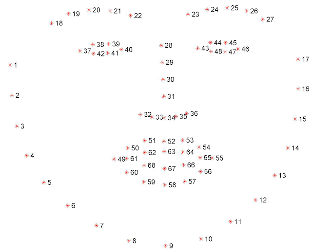

# ARENA Face Detection and Tracking

## JSON format:

```
{
    "object_id": "face_<camera id>",
    "hasFace": <bool>,                  # if there is a face detected/valid data.
    "imFlipped": <bool>,                # if image is flipped or not, set as URL param.
    "imWidth": <src image width>,
    "imHeight": <src image height>,
    "landmarks": [x1,y1,x2,y2.....],    # flattened array of face landmarks as normalized points with image center as origin.
    "bbox": [x1,y1,x2,y2]               # (x1,y1) is upper left and (x2,y2) is lower right.
    "timestamp": <time>
}
```



## URL params:

- trackface (bool)      Enables face detection. Default is 0!
- debugFace (bool)      Enables printing of JSON output and execution time for face detection and MQTT pub + JSON creation.
- vidOff (bool)         Removes live video window
- overlayOff (bool)     Removes overlaying the face wire frame from the video window and the "initializing face detection" text.
- bboxOn (bool)         Show the bbox in the video window.
- flipped (bool)        Flip source image.
- frameSkip (int)       How many frames should be skipped. default is 1 (no frames skipped).
- vidWidth (int)        Sets the width of the video window in pixels, height is scaled by aspect ratio. Rhe larger the width, the slower the face detection will take. Default is 320.

## Building:

Run ```build.sh``` to build. Optional flag ```--force```.

## Citations:

[https://ibug.doc.ic.ac.uk/resources/facial-point-annotations/](https://ibug.doc.ic.ac.uk/resources/facial-point-annotations/)
