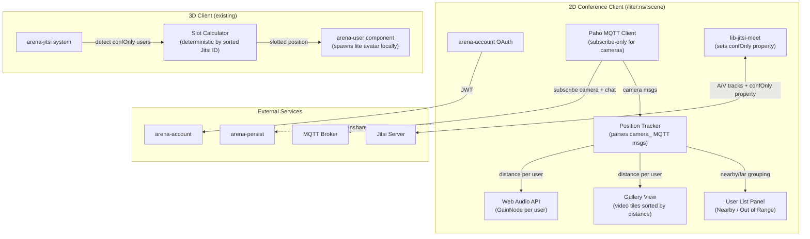
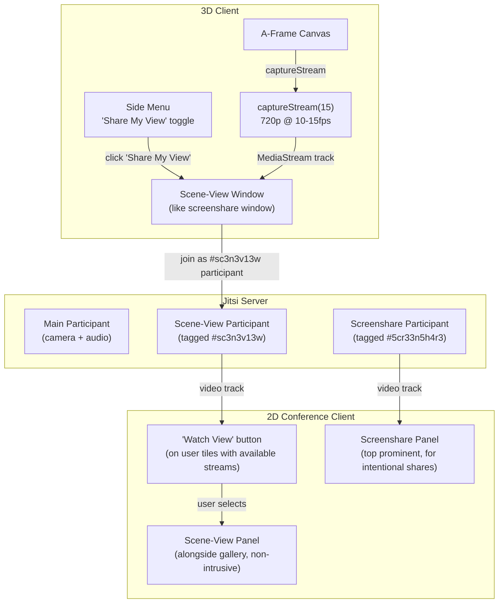

# External 2D Conference-Only Clients for ARENA

> **Goal**: Enable resource-constrained devices to participate in ARENA scenes via a lightweight 2D conference interface that preserves spatial audio semantics, without requiring full 3D rendering.

## Synthetic Energy/Compute Comparison

Before committing to either path, here's a theoretical comparison of the two approaches on a resource-constrained device (e.g. mobile phone, low-end laptop).

### Subsystem Resource Matrix

| Subsystem | Full 3D Client | **Path B: Slim 2D Client** | **Path A: Stock Jitsi + Breakout Rooms** |
|-----------|----------------|----------------------------|------------------------------------------|
| **WebGL/GPU** | Heavy — A-Frame/three.js renders full scene, gaussian splats, GLTF models, post-processing | **None** — no 3D rendering at all | **None** — stock Jitsi UI only |
| **CPU (JS)** | Heavy — ECS tick loop, raycasting, physics, animation | **Light** — distance calc per user (~1ms/tick), Web Audio gain | **Minimal** — Jitsi manages everything |
| **Memory** | 200–800MB — scene objects, textures, geometry buffers, A-Frame ECS | **~50–80MB** — MQTT client, Jitsi tracks, DOM gallery tiles | **~60–100MB** — stock Jitsi Meet UI |
| **Network ↓** | High — all MQTT scene traffic + Jitsi A/V + model/texture downloads | **Low** — camera-only MQTT subs (~2KB/s per user) + Jitsi A/V (distance-constrained) | **Medium** — full Jitsi A/V (breakout-room scoped but no distance-granular control) |
| **Network ↑** | Medium — camera pose MQTT pub + Jitsi A/V upload | **Very Low** — NO MQTT camera publishing (Jitsi signaling only) + Jitsi A/V upload | **Low** — Jitsi A/V upload only |
| **Battery** | High drain — continuous GPU + CPU + network | **Low drain** — no GPU, minimal CPU, selective network | **Low drain** — no GPU, Jitsi-managed |
| **File downloads** | Large — GLTF models, textures, splats, vendor JS (A-Frame ~300KB, three.js ~600KB) | **Small** — lib-jitsi-meet.min.js (~500KB already loaded) + Paho MQTT (~30KB) + lite page (~20KB) | **Medium** — full Jitsi Meet bundle (~2–5MB) or mobile app |
| **Spatial audio fidelity** | ✅ Continuous — Web Audio positional audio with `distanceModel`/`refDistance`/`rolloffFactor` | ✅ **Continuous** — Web Audio GainNode with same distance model parameters | ❌ **Discrete** — breakout rooms are binary (in room = full audio, different room = silent) |
| **Venn diagram problem** | N/A | **N/A** — each client does its own distance math independently | ⚠️ **Unsolvable cleanly** — overlapping audio ranges can't map to discrete rooms without splitting users |
| **MQTT auth overhead** | Already required | **Light** — connects for chat + camera position *subscription* only (no camera *publishing*) | **Not needed** — but loses MQTT chat, presence, position awareness |
| **Implementation complexity** | Existing | **Medium** — new page, MQTT position tracking, Web Audio gain, gallery UI | **High** — breakout room API integration, grouping algorithm, moderator election, Jitsi API version dependencies |

### Verdict

| Criterion | Path B (Slim 2D Client) | Path A (Jitsi Breakout Rooms) |
|-----------|-------------------------|-------------------------------|
| Energy savings vs. full 3D | **~70–80% reduction** | **~70–80% reduction** |
| Spatial audio fidelity | **✅ Continuous falloff** | **❌ Binary (in/out of room)** |
| Grouping correctness | **✅ Per-user independent** | **⚠️ Venn diagram ambiguity** |
| Implementation effort | **Medium** | **High** |
| Maintenance burden | **Low** — self-contained page | **High** — depends on Jitsi breakout room API stability |
| MQTT integration | **✅ Chat + position tracking** | **❌ None** — external Jitsi clients can't see MQTT |
| User list consistency | **✅ Shared** — appears in ARENA user list | **⚠️ Partial** — Jitsi users visible, but no distance grouping |

> [!IMPORTANT]
> **Recommendation: Path B (Slim 2D Client)** is the clear winner. It achieves the same energy savings as Path A while preserving continuous spatial audio fidelity, avoids the unsolvable Venn-diagram grouping problem, and integrates fully with ARENA's MQTT-based chat systems. Path A should be preserved as a documented fallback for cases where users cannot load any custom client at all (e.g. joining via Jitsi mobile app with zero setup).

---

## Proposed Changes — Phase 1: Slim 2D Conference Client

### Architecture

### Presence Model: Jitsi-Only Signaling (No MQTT Camera Publish)

> [!IMPORTANT]
> 2D users do **NOT** publish MQTT camera/presence messages. All presence is handled via Jitsi participant properties. This saves energy and avoids duplicate signaling from the 2D client's perspective.

**How it works:**

1. **2D client** joins Jitsi and sets participant properties:
   - `arenaId` → their ARENA idTag
   - `arenaDisplayName` → their display name
   - `confOnly` → `true` (new property)

2. **3D clients** detect `confOnly` users via existing `PARTICIPANT_PROPERTY_CHANGED` handler in [jitsi.js L761–L785](file:///Users/mwfarb/git/arena-services-docker/arena-web-core/src/systems/core/jitsi.js#L761-L785)

3. **3D clients** deterministically compute slotted positions:
   - Get all `confOnly` participants from `conference.getParticipants()`
   - Sort by Jitsi participant ID (deterministic across all clients)
   - Assign semicircle positions around the screenshare object anchor
   - Spawn a local-only `arena-user` avatar at the computed position

4. **All clients** (both 3D and 2D) see the same set of users in the user list via Jitsi events

> [!NOTE]
> **Future follow-up (post Phase 2)**: Add optional MQTT camera publishing from 2D clients so arena-py programs and arena-persist can also see them. This would be a belt-and-suspenders approach for full ecosystem visibility.

### New Files

---

#### [NEW] [lite/index.html](file:///Users/mwfarb/git/arena-services-docker/arena-web-core/lite/index.html)

Standalone HTML page for the 2D conference-only client. Loads:
- `lib-jitsi-meet.min.js` from `/static/vendor/`
- Paho MQTT client
- Arena auth bootstrap (same `ARENAAUTH` flow as `index.html`)
- `lite/index.js` for all conference logic
- `lite/style.css` for gallery layout

Contains:
- Gallery container for video tiles (sorted by distance)
- User list panel ("Nearby" / "Out of Range" sections)
- Chat panel (send/receive via MQTT)
- Fixed position indicator (shows scene name + slotted position)
- Badge showing `N/M` user count format

---

#### [NEW] [lite/index.js](file:///Users/mwfarb/git/arena-services-docker/arena-web-core/lite/index.js)

Core logic for the 2D conference client (~400–600 lines estimated). Key modules:

1. **Auth & Connect**: Reuse arena-account OAuth flow → get JWT → connect MQTT (subscribe-only) + Jitsi
2. **MQTT Position Tracker**: Subscribe to `realm/s/:ns/:scene/+/+`, filter for `camera_*` object IDs, parse position from `data.position` fields. Maintain a `Map<userId, {x, y, z}>` of all user positions.
3. **Slot Position Calculator**: Fetch screenshare/screenshareable object position from the **persistence API** at load time. Use the oldest screenshareable object position, falling back to the default screenshare position `(0, 3.1, -3)`. Compute own slotted position in semicircle facing the screenshare.
4. **Jitsi Conference**: Join the same Jitsi room as 3D users (room name = `ARENA.namespacedScene`). Set `arenaId`, `arenaDisplayName`, and `confOnly: true` participant properties. **No MQTT camera publishing** — Jitsi signaling is the sole presence channel.
5. **Distance Calculator**: Every 1s, compute distance from slotted position to each tracked user. Determine `nearby` (≤ `maxAVDist`) vs. `outOfRange` (> `maxAVDist`).
6. **Web Audio Gain**: For each remote Jitsi audio track, route through a `GainNode`. Set gain using the inverse distance model: `gain = refDistance / (refDistance + rolloffFactor * (distance - refDistance))`, matching Web Audio's `inverse` distance model with scene-option parameters. Mute (gain=0) beyond `maxAVDist`.
7. **Video Constraints**: Use `setReceiverConstraints` to reduce resolution for distant users and drop video for users beyond `maxAVDist`, matching [arena-user.js L600–L613](file:///Users/mwfarb/git/arena-services-docker/arena-web-core/src/components/camera/arena-user.js#L600-L613) behavior.
8. **Gallery Renderer**: Create/update video tile elements sorted by distance. Show user name, distance indicator, muted icon. Tiles for users beyond `maxAVDist` are hidden or dimmed.
9. **Chat Integration**: Subscribe to MQTT chat topics. Display incoming messages. Send outgoing messages via MQTT (matching [chat.js](file:///Users/mwfarb/git/arena-services-docker/arena-web-core/src/systems/ui/chat.js) protocol).

---

#### [NEW] [lite/style.css](file:///Users/mwfarb/git/arena-services-docker/arena-web-core/lite/style.css)

Gallery layout styling:
- CSS Grid for responsive video tile layout
- Distance-based opacity/scale for tiles
- "Nearby" / "Out of Range" section headers
- Consistent with ARENA's existing dark theme

---

### Modified Files

---

#### [MODIFY] [src/systems/core/jitsi.js](file:///Users/mwfarb/git/arena-services-docker/arena-web-core/src/systems/core/jitsi.js)

Handle `confOnly` participants from Jitsi signaling:

- **`onUserJoined()` / `PARTICIPANT_PROPERTY_CHANGED`** (~L538–L785): When a user with `confOnly: true` is detected, emit a new event (e.g. `JITSI_EVENTS.CONF_USER_JOINED`) with their `arenaId` and `arenaDisplayName`.
- **`onUserLeft()`** (~L596–L651): Emit `JITSI_EVENTS.CONF_USER_LEFT` when a `confOnly` user departs.
- **New helper `getConfOnlyParticipants()`**: Return sorted list of `confOnly` participants by Jitsi participant ID, used by the slot calculator.

---

#### [MODIFY] [src/components/camera/arena-user.js](file:///Users/mwfarb/git/arena-services-docker/arena-web-core/src/components/camera/arena-user.js) (or new companion component)

Handle spawning and positioning of `confOnly` user avatars:

- **Listen for `CONF_USER_JOINED` / `CONF_USER_LEFT`**: Spawn/remove a local-only `arena-user` entity at the deterministically computed slotted position.
- **Slot Position Calculator**: Compute semicircle positions around the screenshare anchor. Inputs: sorted `confOnly` participant list, screenshare object position from persistence. All 3D clients compute the same result.
- **`tick()`** (~L538–L626): After computing `this.distance`, report it to the chat system's `liveUsers` dict so `populateUserList()` can sort by distance: `this.chat.liveUsers[this.idTag].distance = this.distance;`

---

#### [MODIFY] [src/systems/ui/chat.js](file:///Users/mwfarb/git/arena-services-docker/arena-web-core/src/systems/ui/chat.js)

Update the user list to support proximity-based grouping (benefits both 3D and 2D clients):

- **`populateUserList()`** (~L892–L1036): Split user list into "Nearby" and "Out of Range" sections. Sort by distance within each section. Show `N/M` badge format only when any users are out of range (single digit when all are in range).
- **`nSceneUserslabel` / `usersDot`** (~L923–L924): Change from single count to conditional `N/M` format.
- **`onUserJitsiJoin()`** (~L555–L567): Detect `confOnly` property from Jitsi and set `type: UserType.CONF` (new user type, labeled `(2D)` in the list).
- **New field on `liveUsers[id]`**: Add `distance` property, updated from `arena-user` tick.
- **New `UserType.CONF`**: New user type constant for 2D conference-only users, displayed as `(2D)` instead of `(external)`.

---

#### [MODIFY] nginx config (conf-templates or arena-services-docker)

Add a route for `/lite/` that serves `lite/index.html`, matching the existing pattern for `/screenshare/` and `/replay/`.

---

## Proposed Changes — Phase 2: Scene-View Streaming ("Watch View")

### Architecture

### New Files (Phase 2)

---

#### [NEW] [sceneview/index.html](file:///Users/mwfarb/git/arena-services-docker/arena-web-core/sceneview/index.html)

Standalone page for canvas capture, following the [screenshare/index.html](file:///Users/mwfarb/git/arena-services-docker/arena-web-core/screenshare/index.html) pattern. Opens in a new window when the 3D user clicks "Share My View".

---

#### [NEW] [sceneview/index.js](file:///Users/mwfarb/git/arena-services-docker/arena-web-core/sceneview/index.js)

Canvas capture logic (~100–150 lines), modeled on [screenshare/index.js](file:///Users/mwfarb/git/arena-services-docker/arena-web-core/screenshare/index.js):

1. Receive the A-Frame canvas element reference from the opener window
2. Call `canvas.captureStream(15)` to produce a 10–15fps MediaStream
3. Join Jitsi as a separate participant tagged with `#sc3n3v13w` prefix
4. Set participant properties: `sceneViewDispName`, `sceneViewIdTag`
5. Add the captured video track to the conference
6. Show a preview + "Stop Sharing" button (matching screenshare UX)

---

### Modified Files (Phase 2)

---

#### [MODIFY] [src/systems/ui/icons.js](file:///Users/mwfarb/git/arena-services-docker/arena-web-core/src/systems/ui/icons.js)

Add a new side-menu button: "Share My View" (eye/camera icon). Clicking opens `sceneview/index.html` in a new window, passing canvas reference and Jitsi connection params (same pattern as screenshare).

---

#### [MODIFY] [src/systems/core/jitsi.js](file:///Users/mwfarb/git/arena-services-docker/arena-web-core/src/systems/core/jitsi.js)

- **`onRemoteTrack()` / `onUserJoined()`**: Detect `#sc3n3v13w`-tagged participants. Emit a new `JITSI_EVENTS.SCENE_VIEW` event with the participant ID and display name.
- **`onUserLeft()`**: Clean up scene-view streams when the sharing participant leaves.

---

#### [MODIFY] [lite/index.js](file:///Users/mwfarb/git/arena-services-docker/arena-web-core/lite/index.js)

- **Scene-view detection**: Listen for `#sc3n3v13w`-tagged Jitsi participants. Display a "Watch View" button on the corresponding user's gallery tile.
- **View panel**: When clicked, display the scene-view stream in a dedicated panel alongside (not replacing) the gallery.
- **Screenshare distinction**: Intentional screenshares (`#5cr33n5h4r3`) appear in a prominent top panel. Scene-view streams appear in a separate selectable panel.

---

### Future Follow-up (Post Phase 2)

- **Requested scene view**: A 2D user requests a 3D user's view → the 3D user gets a notification prompt → if accepted, the 3D client computes a canvas from the 2D user's spatial perspective and streams it. This is the most immersive version but requires significant rendering overhead on the 3D side.
- **Auto-detect and suggest**: The full 3D client detects poor performance (low FPS, low memory) and shows a popup recommending switching to `/lite/` mode.
- **MQTT camera publishing from 2D clients**: Optional belt-and-suspenders approach so arena-py programs and arena-persist can also see 2D users.

---

## Path A Fallback Documentation

> [!NOTE]
> Include a brief documentation page (in [arena-docs](file:///Users/mwfarb/git/arena-docs)) explaining how to use stock Jitsi mobile clients to join an ARENA scene's Jitsi room directly. This serves users who truly cannot load any web page:
>
> - **URL format**: `https://<jitsiHost>/<namespacedScene>` (the Jitsi room name matches the ARENA scene name)
> - **Limitations**: No spatial audio (all participants at equal volume), no MQTT chat/presence, no distance-based muting, user appears as `(external)` in the ARENA user list
> - **Use case**: Emergency fallback for severely constrained devices or users without browser access
> - **Note**: Modern Jitsi Meet web clients offer a link to install the mobile app, so users can also join via the Jitsi iOS/Android app

---

## Verification Plan

### Manual Verification — Phase 1
- Load the 2D conference client (`/lite/:ns/:scene`) on a mobile phone and verify:
  - Auth flow completes and connects to MQTT + Jitsi
  - Gallery shows video tiles of 3D users in the same scene
  - Audio volume scales with distance from slotted position
  - Users beyond `maxAVDist` are muted and tiles are dimmed/hidden
  - User list shows "Nearby" / "Out of Range" sections
  - Badge shows `N/M` format when distant users exist, single digit when all are in range
  - Chat messages are sent/received via MQTT
  - 3D users see the 2D client as a standard avatar at the slotted position (spawned locally by all 3D clients at the same deterministic position)
  - Multiple 2D users get distinct slotted positions in a semicircle
  - 2D user appears as `(2D)` in the user list (not `(external)`)
- Compare CPU/memory/battery usage vs. full 3D client on same device using browser DevTools

### Manual Verification — Phase 2
- 3D user clicks "Share My View" → scene-view window opens → canvas is captured at 10–15fps 720p
- 2D user sees "Watch View" button on the sharing user's tile
- Clicking "Watch View" shows the scene-view stream in a dedicated panel
- Intentional screenshares still appear in a separate prominent top panel
- 3D user clicking "Stop" in the scene-view window cleanly tears down the stream

### Automated Tests
- Verify the nginx route serves `lite/index.html` correctly
- Verify the distance calculation matches the Web Audio inverse distance model
- Verify the deterministic slot position algorithm produces identical results given the same participant list
- Verify the user list grouping logic with mock position/distance data
