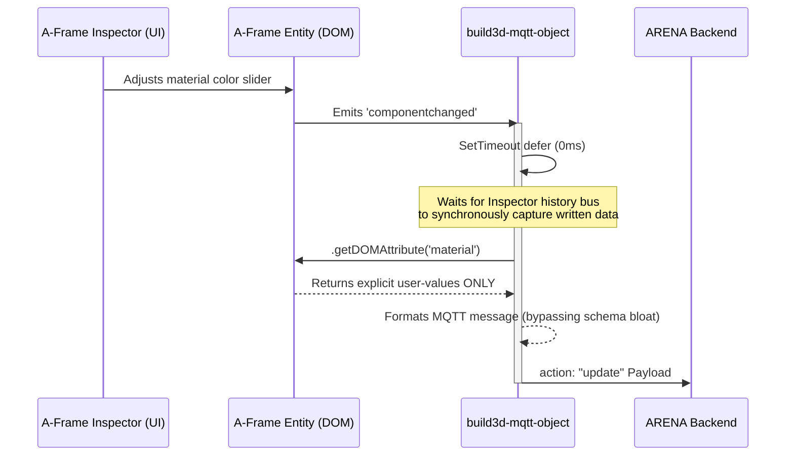
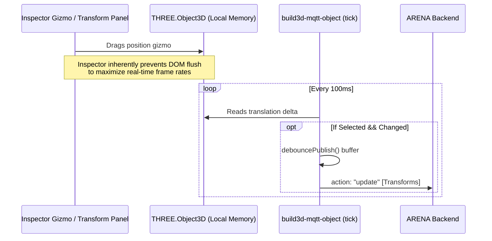

# ARENA Build3D Architecture

The `build3d` system acts as a real-time translation layer between the local [A-Frame Inspector](https://github.com/aframevr/aframe-inspector) and the continuous networked ARENA MQTT backend. It ensures any edits made by a local user in the visual editor are instantly and cleanly propagated to all other clients in the scene.

## Component Overview

### 1. `build3d-mqtt-scene`
**Responsibility:** Scene-level observer and UI injection.
- **Node Tracking:** Uses a `MutationObserver` on the A-Frame `<a-scene>` strictly to catch structural `childList` additions. 
- **Auto-attachment:** When a user clicks the "+" button in the Inspector to drop in a new blank entity, `build3d-mqtt-scene` immediately detects it and auto-attaches the `build3d-mqtt-object` component to it, enabling network tracking for that new node.
- **Integrated UI:** Dynamically injects the collapsible "ARENA Build3D MQTT Publish Log" window into the viewport, alongside "Upload to Filestore" injection buttons for applicable components.

### 2. `build3d-mqtt-object`
**Responsibility:** Dedicated, event-driven networking layer on a per-entity basis.
- **Dual-Path Change Detection:** The Inspector uses *two distinct mechanisms* to modify entities, requiring both a `MutationObserver` (catches direct DOM attribute writes like `element.setAttribute('geometry', '...')`) and A-Frame event listeners (`componentchanged`/`componentinitialized`, which catch API-level component modifications). The debounce buffer naturally deduplicates overlapping events from both sources.
- **Transform Ticking (`tick`):** Bypasses the DOM entirely for standard transforms. Evaluates `object3D.position/rotation/scale` via `AFRAME.utils.throttleTick` specifically targeting `AFRAME.INSPECTOR.selectedEntity`. This filters out background physics/animations while preserving the ability to manually edit them. Transform attributes (`position`, `rotation`, `scale`, `class`) are explicitly skipped by the MutationObserver.
- **Component Modifications (`componentchanged`/`componentinitialized`):** Leverages A-Frame's native event emitter to catch component assignments made through the A-Frame API.
- **Attribute Mutations (`objectAttributesUpdate`):** The MutationObserver catches DOM-level attribute writes from the Inspector. Non-id, non-transform mutations are routed through `extractDataUpdates` using `getDOMAttribute()` for clean payloads.
- **ID Mutations:** Debounces `id` string typing internally through a 750ms timeout window. Once the user halts typing, a single `delete` (old ID) and `create` (new ID) MQTT sequence is dispatched safely, eliminating network spam during rapid keystrokes.
- **Payload Truncation:** Intercepts outgoing data via `getDOMAttribute()` to only bundle properties the user explicitly authored. This gracefully side-steps A-Frame component schemas to prevent sending bloated internal engine defaults over the wire, while preserving intentional explicit selections (like resetting a value back to default).

## Workflow Execution (Component Data Mutation)



## Workflow Execution (Transform Mutation)



## Multi-Instance Components

A-Frame supports multiple instances of the same component via double-underscore suffixed names (e.g. `animation__walk`, `animation__idle`, `spe-particles__fire`). Build3D handles these transparently:

- Both the `MutationObserver` and `componentchanged`/`componentinitialized` event paths detect suffixed names and route them through the `default` case of `extractDataUpdates`, publishing `data['animation__walk'] = { ... }`.
- Inbound MQTT messages are applied via `create-update.js`'s `setEntityAttributes`, which calls `entityEl.setAttribute('animation__walk', value)` — A-Frame handles the rest.
- No special-casing for `__` is needed in build3d; the naming convention flows naturally through all paths.

## Known Issues

### `spe-particles` Fog Crash (Upstream)
Adding `spe-particles` without a proper multi-instance suffix (e.g. skipping the Inspector's prefix prompt) can cause a Three.js render crash:
```
TypeError: Cannot set properties of null (setting 'r')
    at refreshFogUniforms
```
This is an upstream issue — the particle system initializes with a null fog color reference. ARENA's `create-update.js` mitigates this by defaulting `affectedByFog = false` for inbound messages, but entities created locally in the Inspector bypass that guard. **Workaround:** Always provide a suffix when the Inspector prompts for one (e.g. `spe-particles__myeffect`).

## Anti-Patterns Addressed
- **DO NOT** bind massive generic `MutationObservers` against the entire A-Frame `childList`/`attribute` scene tree. Subscribing natively to A-Frame lifecycle events (`tick` + `componentchanged`) performs magnitudes faster.
- **DO NOT** cross-reference or dynamically diff internal A-Frame registries (like `.schema`) to trim payload bloat. The official native `getDOMAttribute` efficiently maps explicitly assigned values out of the box and honors user-level reversions natively.
- **DO NOT** manually force `.flushToDOM()` transform writes purely to intercept positional changes. `build3d` reads locally cached `object3D` positional matrices effortlessly, capturing live coordinate modifications before serializing Euler paths to native ARENA quaternions.
